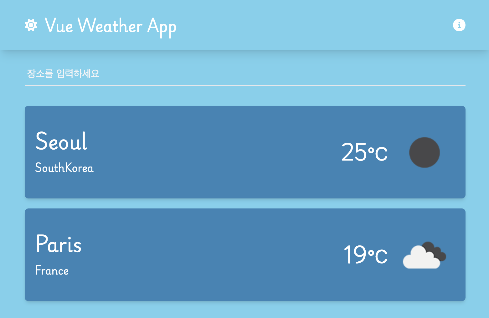
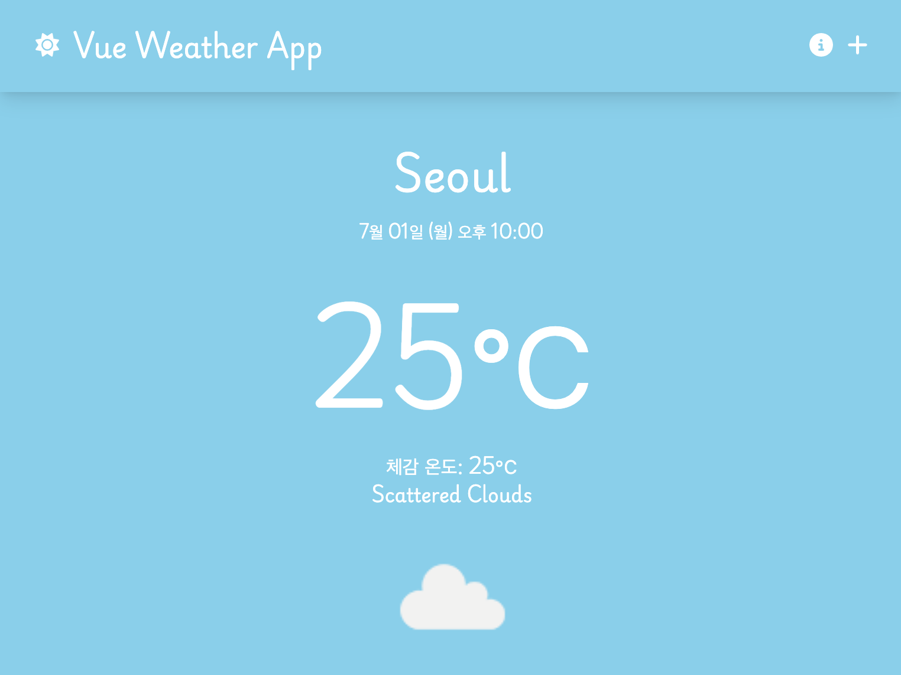
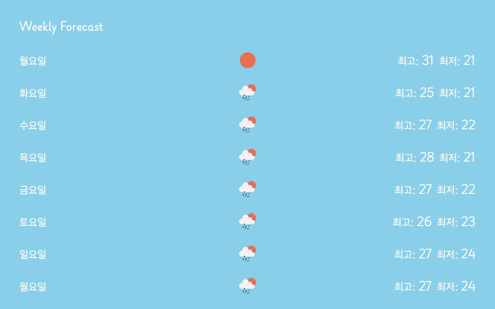

# Weather App with Vue

원하는 장소의 날씨를 검색할 수 있는 Vue.js 기반의 웹 애플리케이션입니다.

- [DEMO](https://fromnowwon.github.io/vue-weather-app/)





## 주요 기능

- 원하는 장소의 날씨 검색
- 특정 장소를 저장 목록에 추가하여 메인에서 확인
- 저장된 장소 삭제 기능

## 설치 및 실행 방법

1. 저장소를 클론합니다.

```bash
git clone https://github.com/fromnowwon/vue-weather-app
```

2. 프로젝트 폴더로 이동합니다.

```bash
cd vue-weather-app
```

3. 필요한 패키지를 설치합니다.

```bash
npm install
```

4. 개발 서버를 실행합니다.

```bash
npm run dev
```

5. 웹 브라우저에서 `http://localhost:3000`을 엽니다.

## 사용 기술

- Vue.js
- JavaScript
- Tailwind CSS

## 폴더 및 파일 구조

```plaintext
├── src/
│   ├── assets/
│   ├── components/
│   │   ├── AsyncDetailView.vue
│   │   ├── BaseModal.vue
│   │   ├── CityCard.vue
│   │   ├── CityList.vue
│   │   ├── Navigation.vue
│   │   ├── SearchForm.vue
│   ├── App.vue
│   ├── main.js
├── router
├── package.json
├── README.md
└── ...
```

- **src/**: 소스 코드가 포함된 디렉토리
  - **assets/**: 이미지 및 기타 자산 파일
  - **components/**: Vue 컴포넌트 파일들
  - **router/**: Router 설정
  - **views/**: 화면 또는 페이지 정의 컴포넌트
- **App.vue**: 주 애플리케이션 컴포넌트
- **main.js**: 애플리케이션 진입점

## 저자

- [Chaewon Jeong](https://github.com/fromnowwon)

## 라이센스

이 프로젝트는 MIT 라이센스 하에 배포됩니다. 자세한 내용은 LICENSE 파일을 참조하세요.

```

위 README.md 예시는 프로젝트의 구조, 설치 및 실행 방법, 주요 기능, 기여 방법, 저자 정보, 라이센스 등을 포함하고 있습니다. 프로젝트의 특성에 맞게 세부적으로 수정하여 사용하시면 됩니다.
```
